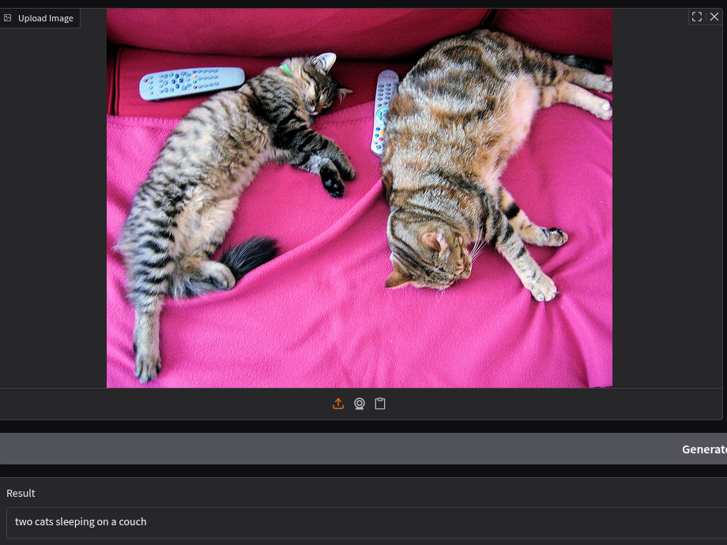

# Multimodal LLM Assignment

## Assignment 5.1: Model Comparison Report
The completed Model Comparison Report (CLIP vs. BLIP) is available as a PDF:  
📄 [5.1_Model_Comparision_Rep.pdf](.//teamspace/studios/this_studio/5.1_Model_Comparision_Rep.pdf)

## Assignment 5.2: Multimodal Application Demo
This repository contains the BLIP Image Captioning web application.



A Python web application that generates accurate captions for images using Salesforce's BLIP model, built with Gradio.

## Table of Contents
- [Features](#features)
- [Demo](#demo)
- [Installation](#installation)
- [Usage](#usage)
- [How It Works](#how-it-works)
- [Examples](#examples)
- [File Structure](#file-structure)


## Features
✔ Upload images or provide image URLs  
✔ Optional text prompts to guide caption generation  
✔ Mobile-friendly responsive interface  
✔ Fast inference using pre-trained BLIP model  
✔ Shareable public links  

## Set up Virtual Environment

```bash
python -m venv venv
source venv/bin/activate  # Linux/Mac
venv\Scripts\activate    # Windows
```

## Install dependencies

```bash
pip install -r requirements.txt
```

## Run the Application
```bash
python app.py
```
## How it works 

Image Processing:

* Images are encoded using Vision Transformer (ViT)

* Optional text prompts are processed with BERT-like encoder

Caption Generation:

* Multimodal fusion via cross-attention layers

* Text generation using transformer decoder

Output:

* Returns human-readable image description

* Typical inference time: 1-3 seconds on CPU

## Examples

### Example 1: Basic Captioning
**Input Image**:  
  
**Output**:  
*"a sandy beach with clear blue water and palm trees"*

### Example 2: Guided Caption
**Input Image**:  
  
**Prompt**: *"a cute"*  
**Output**:  
*"a cute golden retriever puppy playing in the grass"*
